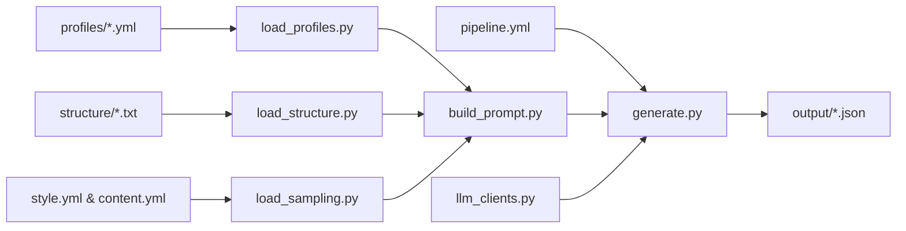

# MESA Docsynth

Configurable pipeline for generating high fidelity synthetic documents that can be turned into training data.

## Getting started

### Assets

The [`DocsynthAssets`](src/docsynth/types/wrapper.py) base class should be extended to wrap assets for a particular domain (e.g. cancer) and pass them to docsynth.
The base class assumes the presence of:

- Primary profiles, one entry per synthetic case, holding whatever domain-specific fields that case needs (formatted according to [`Profile`](src/docsynth/types/profile.py)):
  - `assets/<use case>/profiles/*.yml`

- Probabilistic sampling from style and content requirements, with domain-defined sections (formatted according to [`Style`](src/docsynth/types/sampling.py) and [`Content`](src/docsynth/types/sampling.py)):
  - `assets/<use case>/style.yml`
  - `assets/<use case>/content.yml`

- Example structures that are hand-crafted based on real clinical document formats:
  - `assets/<use case>/structure/*.txt`

- Prompt templates:
  - `assets/<use case>/prompts/`

In addition, concrete implementations should be provided for abstract methods to handle domain-specific asset creation logic.

### Configuration

Using the format specified in the [`config`](src/docsynth/config.py), create `pipeline.yml` to configure the LLM provider (currently Anthropic (AWS Bedrock), Gemini or local), profile sampling mode (random/sequential), prompt configuration, and output directory (see [`pipeline.yml.example`](pipeline.yml.example)).
If using Gemini or Bedrock, configure `.env` with an API key (see [`.env.example`](.env.example)).
Bedrock API keys can be obtained from your AWS account manager.
If not using AWS Bedrock, obtain suitable credentials for another provider (e.g. Gemini Developer API).
If using a local LLM, no/blank credentials will likely be sufficient.

#### Anthropic (AWS Bedrock) batch generation

For batch generation, additional credentials are needed:

  1. Obtain access to AWS from your account manager and follow the instructions [here](https://docs.commonfate.io/granted/getting-started) to set up SSO authentication for use of the AWS CLI.

  2. Obtain information on a Bedrock Execution IAM Role with S3 and model access and information on the name of an S3 bucket to upload a batch specification to.

## Usage

1. Create a `Generator` object, and call the `generate` method:

- For Anthropic (AWS Bedrock) batch generation:

  ```python
  Generator().generate_via_batch(<BATCH_BUCKET>, <BEDROCK_EXECUTION_ROLE>)
  Generator().extract_batch_output(<BATCH_BUCKET>)
  ```

- For other LLM providers, call the method without any additional parameters:

  ```python
  Generator().generate(MyDocsynthAssets())
  ```

2. Generated documents are saved to `./output/{subdirectory}/{doc_id}.json`:

  ```json
  {
    "doc_id": "9893532233caff98cd083a116b013c0b",
    "document_name": "narrative",
    "document_sourcedb": "DocSynth",
    "profile": "lung_001",
    "timestamp": "20251012_143022_477",
    "prompt": "... complete prompt text ...",
    "content": "... generated clinical document ..."
  }
  ```

Note: when `llm.enabled: false` in `pipeline.yml`, only prompts are saved (no `content` field).

### Flowchart


